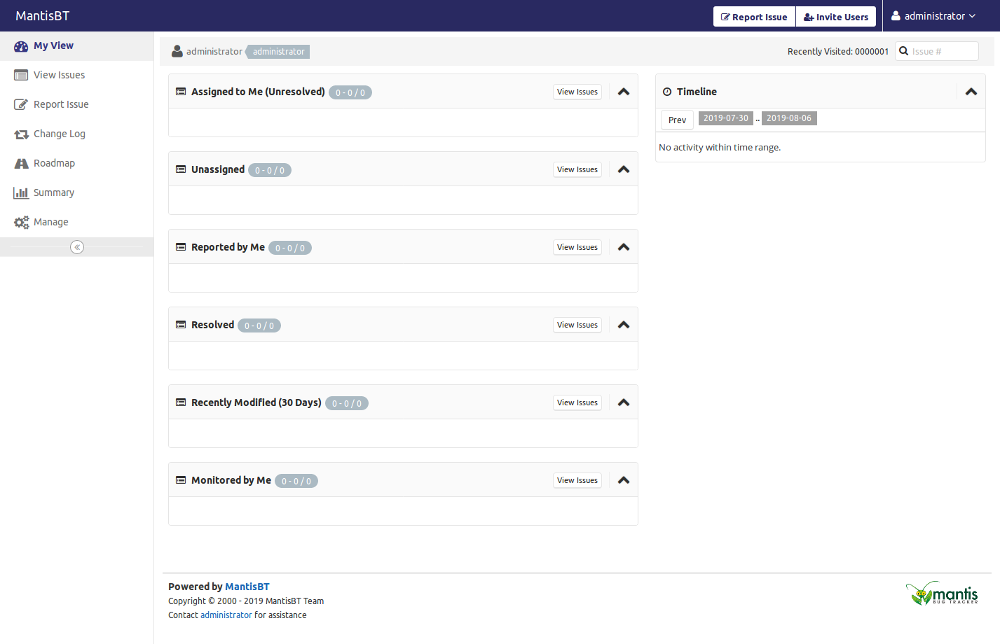

# mantisbt-gitlab-theme
Unlike GitLab, Mantis is a full-fledged bug tracking system specifically designed for a software project life cycle. Unfortunately, the UI is outdated and here is an effort to make it contemporary with GitLab and GitHub like look and feel.

## Screenshots
 * Buglist View

 * [Screenshot of the Issue](screenshot/Manage-Plugins.png "Issue")

 [More..](https://github.com/jssaints/mantisbt-gitlab-theme/tree/master/screenshot)

## Installation
### Requirements
 * MantisBT 

### Installation
 1. Download
 2. Unpack the package
 3. Copy all files from the unpacked folder `css/*` to `<mantis_root>/css/`
